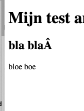

= Findings
:toc:

== Research questions
For this proof-of-concept, we would like to answer the following questions:

- What are the possibilities with respect to Authorization (multi tenant)?
- Is there any integration with external single-sign-on systems/protocols, such as Azure/OpenID?
- Is there a workflow? Can we configure it? Can we schedule publications?
- Where are images/assets stored? Can we link an external storage such as s3?
- To what extend is there a flexible richtext-editor? Is there the ability to add crosslinks / images / documents / ...?

== Investigation method

To get some hands-on experience with each individual headless-CMS that we're investigating, we setup a small proof-of-concept with sample data from our vproapi. For that, we used 3voor12-updates to model the data, and import 3voor12-updates from the vproapi into Prepr. In addition, we read the Prepr-documentation and asked questions to Prepr (users) about their experience on the topics.

== Authorization

As an organisation, you can have multiple environments (https://docs.prepr.io/account/environments/). Each environment has its own "schema" (https://docs.prepr.io/create-schema/overview), which defines the structure of the content for that specific environment. It contains models, components and remote content.

Given the structure of environments and schema's, users in Prepr can be defined on two levels: on the organisation level (thus for all environments) and on an environment-level (https://docs.prepr.io/account/users/#managing-user-accounts).
It is not exactly clear wether this also holds for roles & permissions, but it seems that fine-grained custom roles can be created per environment (https://docs.prepr.io/account/roles-and-permissions/) (TODO: ask Prepr / EO about this).

== Single Sign-on

There are two options regarding single sign-on: 1) using Prepr's custom SSO, or 2) using Azure AD (https://docs.prepr.io/account/sso). There is no option for connecting with Keycloak (OpenID). To what extend roles can be synced is not clear from the documentation.
(TODO: ask Prepr / EO about how roles are arranged within AD or Prepr, and whether they are syncable from AD)

== Workflows

Prepr has a fixed workflow, and looks somewhat like productivity tools such as Jira: there is a flow from TO-DO until done. Check out https://docs.prepr.io/managing-content/collaboration-and-workflows/ for an elaborate description.

Prepr-workflows have the following steps:
- To do: someone has to work on this item
- In progress: item is being worked on
- Review: item can be reviewed by a colleague
- Done: item is done and can be published
- Archived: item is not in use anymore

When testing the workflow, it is not going automatically / logically going from one phase to another. As an editor, you have to set the workflow-status yourself (changing it in the dropdown). There's even the possibility to set it immediately to "Done". Not sure if this is just out environment where it works like that (TODO: ask Prepr / EO about workflow and whether we can give permissions to certain people for certain workflow statuses). A workflow like this could be useful, but only if people can not cut corners by changing the status to "Done" themselves, if there should be a reviewer in the process. In addition, if you want a scheduled publication you need to enable the slider with "Schedule" on the right-side of the screen, otherwise an item will automatically get published as soon as it is set to "Done".

Some nice features here are: commenting / discussing an item with a fellow editor and the button "View on example site". Not sure how the latter works (TODO: ask Prepr / EO about preview). In addition, all content items can be viewed on a Kanban-board, which gives a clear overview of all the work to be done.

At last, workflow-automation can be added. This works similar to e-mail filter-rules: if a certain condition is met (e.g. status is set to "Done"), a certain action follows automatically (e.g. link it to another item).

== Images & assets

Prepr has a custom Asset-management-system with CDN (https://docs.prepr.io/managing-content/introduction-to-assets). The following types are supported:

image::findings/prepr_filetypes.png[]

There are some options for editing images in content items, such as cropping, add a caption or aligning the image (https://docs.prepr.io/managing-content/images). There's nothing explicitly mentioned about metadata-customization (TODO: ask about adding custom metadata such as license information).

In the documentation, it is not mentioned wether external solutions such as s3-storage are available, probably meaning it is not available. TODO: ask Prepr / EO about s3-storage

== Editor

The Richtext-editor has several options for enriching text, using basic options such as bold/italic, and more advanced options such as tables with table-headers and text-alignment.
In addition, it is possible to link to images/assets and to one or more content-items.

== Playing with Prepr

- Bootstrapped with sample data/model
- Renamed article to Drievoor12update
- Added and removed some fields
- The id field will contain the original id (in magnolia, in elasticsearch and in the api)

== Model

No idea if the model allows for enough features. E.g. I tried to add a UUID field, to store the original UUID in magnolia. I think I could only try to validate it with regex pattern?

In this case it would perhaps make sense to just reused the id, UUID are unique, aren't they? I haven't figured out how to do that yet.
- Simple posting to content_images/<my uuid> gives 404.  -> Isn't possible right now (though Tim suggest that it might be possible to improve that)

I have no idea if we could supply custom field types, e.g. integration for the POMS CMSSelector, for the Thesaurus, for Proof of Provenance fields. 

=== Security

For 3voor12 we also have users which may only edit a subset of the content.

I found https://prepr.io/blog/new-role-based-access-control

The contained link to the documentation is broken, but I found https://docs.prepr.io/account/roles-and-permissions/
(btw, if they used prepr to make their own website, we might conclude that cross links are fragile!)

According to documentation we should be able to manage roles:
'User roles can be managed by all users who have the Organization permission of Roles. To manage user roles, click the environment dropdown at the top right, choose your organization and click  to open the environments overview, then go to User management > Roles. Here you can see a list of all roles in your organization.
'

I might be overlooking it or lacking permissions, but I can't find it.

-> Yes, it had to do with that.

I've seen it now, it seems to  offer rights per content model/locale.
I think that for 3voor12 updates this would e.g. mean that different lokaal-temas would have their own copy of the content model?

We like to have integration with keycloak, which may not be possible, but I think there is an integration with azure: https://docs.prepr.io/account/sso
, which also might fit our needs.

=== tree structure

In magnolia the updates are actually stored in a tree, also because of the mentioned authorization issue. I think in prepr content is not in any tree, but just a flat list. This might be preferable by the way. I suppose we could use collections to have a similar division structure. (3 voor 12 Utrecht, 3voor 12 Amsterdam, etc)

=== Images

I haven't tried images yet. I think we feel that it would be nice if images could be stored outside the CMS itself. But see the previous point, in that case some GUI plugin must be possible to arrange the integration.

=== Model in code
It should be possible to maintain the model in code. It is at least possible to export it. According to Tim I should be possible to import it too. I didn't succeed in making a change and updating it, but I didn't try very hard.

Also model (and problably everything alse) are referred to by UUID, which may be needed here and there. E.g. when using the backend api. UUID's are hard to remember and to read, and there is the risc that they change when rebuilding the model somewhere else, making it necessary to maintain mappings from uuids to names. Perhaps this can be remedied, or perhaps it is not a problem in practice.

== Custom gui 

This https://docs.prepr.io/create-schema/remote-content-source may facilate a few of the things we may need.

'Upgrade om meer remote sources toe te voegen
1 remote sources zijn toegestaan in het community plan. Upgrade naar Entry, Scale or Enterprise om er meer toe te voegen.'

-> Ze bedoelen: 'er is maar 1 remote source toegestaan'. Ik was in war door de onduidelijke grammatica. Heb de example webshop verwijderd, en toen kon ik er inderdaad eentje maken. Ging nog van alles aan fout. Api raakt kapot door inconsistent data die daardoor onstond. Ze moesten handmatig caches clearen, anders kon ik het helemaal niet verwijderen. (ik had de componenten die het gebruikte verwijderd, maar hij bleef zeggen dat ik de remote source niet mocht verwijderen om dat er nog componenten waren die het gebruikten)

* Is het ook mogelijk om een externe DAM te gebruiken?
 --> Ze schrijven van wel.

=== field types
https://docs.prepr.io/create-schema/field-types 

Wordt gesproken of een 'comprehensive list', dus ik vermoed dat het niet voor de hand ligt om er iets aan te customizen. ->
Ze hebben gezegd dat het inderdaad niet kan. Maar dat ze natuurlijk eventueel wel kunnen overwegen om het toe te voegen.

=== remote source

https://docs.prepr.io/integrations/build-your-own

Dat zijn blijkbaar de opties. Je moet een api aanbieden die precies doet hoe het daar is gespecificeerd. Aangezien de EO prepr gebruikt dacht ik dat misschien https://pomslookup.eo.nl/ zou kunnen volstaan, maar dat is niet zo, dat is domweg een bakje javascript dat rechstreeks met de NPO frontend api praat.

== Issues & Remarks

- Het was mogelijk om een artikel te maken zonder content, artikel pagina gaf foutmelding. Validatie-issue/frontend-issue?

- De titel zag er eerst raar uit:
+

Kon domweg gefixt worden in de redactieomgeving, want daar had ik blijkbaar een onzichbare whitespace gemaakt. Maar raar dat dat zo makkelijk gebeurt.
- Ik weet niet wat ik er van vind dat alles is geprefixt met locales.
- Debuggen kan ook via de gui bij de access token. Daar kun je zien wat je recent fout deed.
- Ik had mgnl_uuid veld per ongeluk een maximale lengte gegeven. Dat later niet nodig gevonden, en weer verwijderd, maar hij blijft fouten geven over body.length.max. Caching? Defaults?
- LInk https://docs.prepr.io/reference/rest/v1/fetching-working-with-fields naar graphql is broken
- Queries lijkt niet per se goed te werken. Je kunt queryen op slug: https://docs.prepr.io/reference/rest/v1/fetching-single-items, maar hoe ik dan op een andere veld zou moeten queryen, is mij niet duidelijk. slug vervangen door mgnl_uuid lijkt domweg te worden genegeerd (geen validatie op query parameters natuurlijk)
 -> zie 3voor12-updates.py voor hoe het wel gaat.
- Er is een link:https://studio.apollographql.com/sandbox/explorer[tool om graphql queries samen te stellen], maar die ben ik steeds kwijt.

== Data migration

As a test, and to have some data to play with, I migrated the latest 3voor12 updates to prepr.

https://docs.prepr.io/developing-with-prepr/migrate-content

https://docs.prepr.io/reference/rest/v1/content-items-create-update-and-destroy

=== python

[source, bash]
----
mihxil@baleno:~$ python3 -m venv ~/venvs/vpro-migrate
mihxil@baleno:~$ source ~/venvs/vpro-migrate/bin/activate

pip3 install elasticsearch python-dotenv requests
----

Tunnel ES:
[source, bash]
----
ssh -L9210:localhost:9200 os2-api-prod-01
----

Run the link:migrate-test/3voor12-updates.py[script]. 

- This will the latest (published) 3voor12 updates to prepr
  * this may not be correct, because we may also want to migrate unpublished updates 
- slugs are not filled, for some reason
  * we don't use slugs in the current setup (using the api), but just refer to by uuid. For seo we just put the title in the url?
- 

== Interesting extra features

- kanban board
- debug-tools
- a/b testing
- ..

== Conclusion?

- Prepr seems to be a straighforward headless CMS. With a graphql api. I could quite easily migrate some existing content and make two different frontends with it.
- It has some interesting features
 * like a log of executed queries per access token
 * like webhook call backs
 * like a / b -testing (not tried) 
 * personalization (not tried)
 * workflow and embargos
 * 'kanban'view on workflow
 * ..
- It may be somewhat fragile, I encountered several issues, which may  be partially caused by my unwieldy  behaviour (as I was trying things out), so I can't say for sure that this would be common in practice.
- There is also a backend api which can be used to post json to create or modify content.  E.g. for migration purposes.
- We would have little influence on details of the gui, but otherwise complete freedom on how to structure the data. It has a bunch of field types, which can be grouped into components, and we could have 'remote sources', wich may be useful for some use cases.
- I think there is integration with azure (I even encountered bnnvara and eo links in radio prepr)

